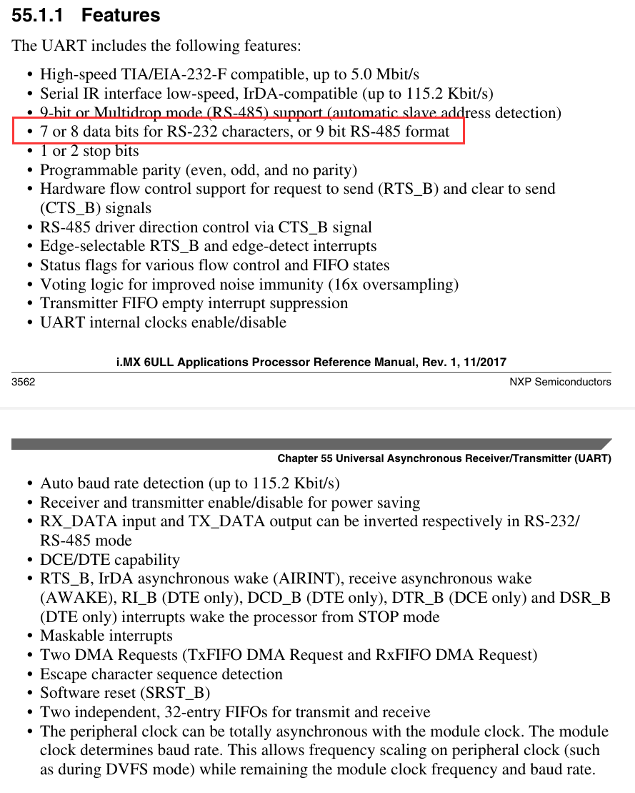
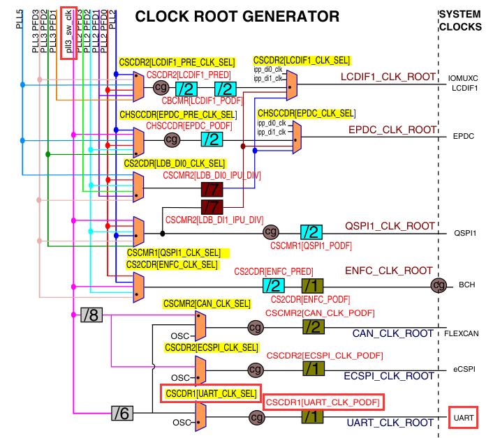
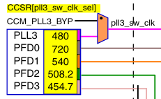
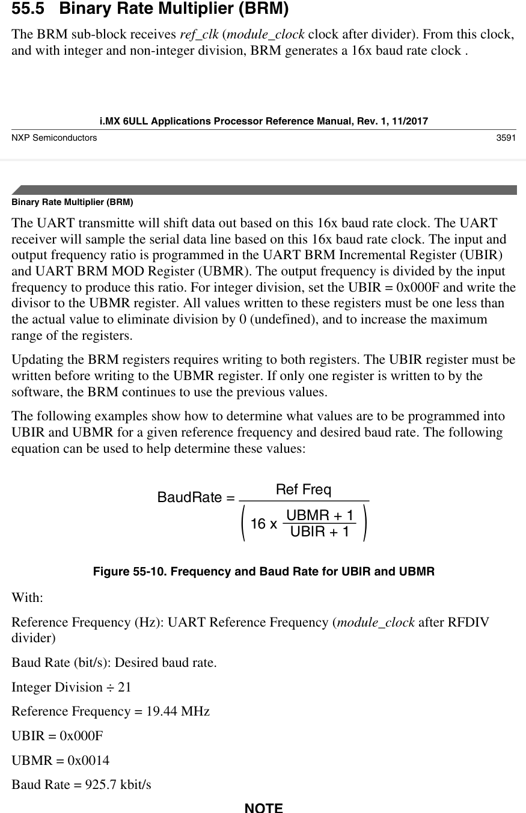
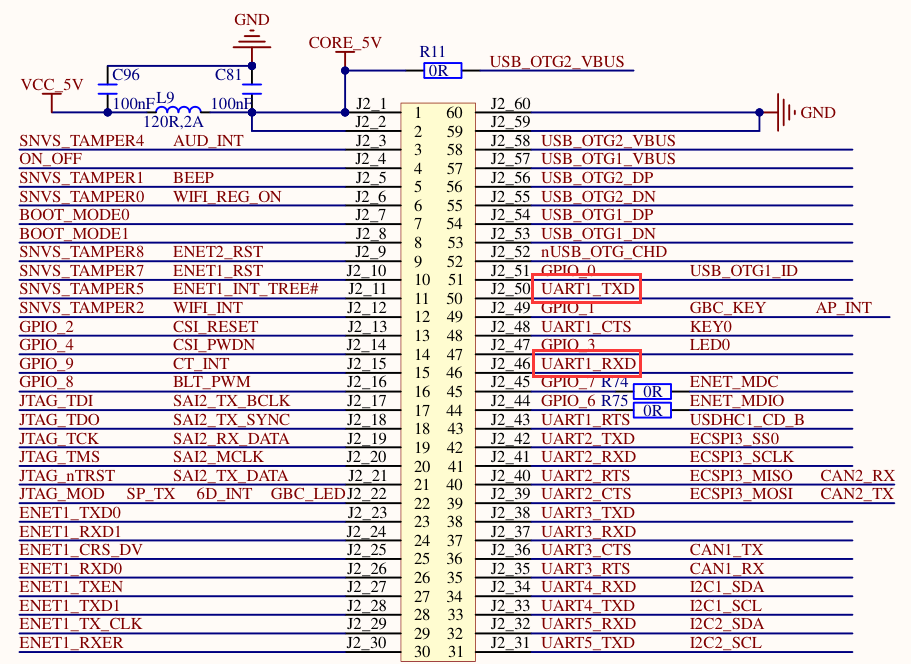
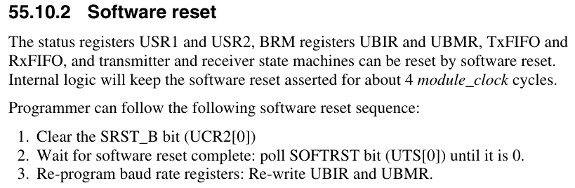
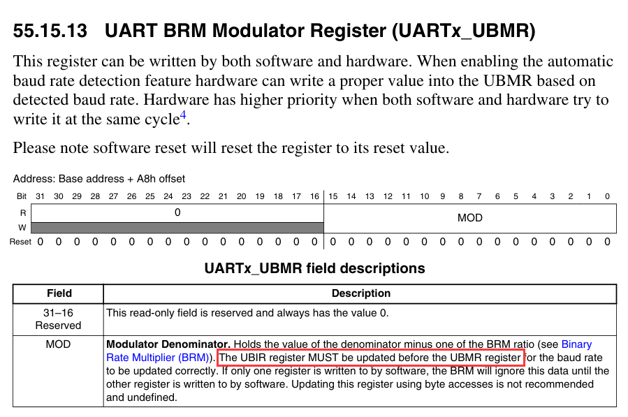

## UART


UART特性








由时钟树图可知，UART时钟源通过多路选择器可以选择来自晶振或者pll3_sw_clk，而pll3_sw_clk又通过一个多路选择器选择是来自PLL3还是CCM_PLL3_BYP。设置时钟源来自PLL3(480MHz)，将设置以下寄存器位

CCM_CCSR[bit0] = 0,

CCM_CSCDR1[bit6] = 0

CCM_CSCDR1[bit11:13] = xxx（分频值）



计算波特率
$$
\mathbf{BaudRate} = \frac{\mathbf{RefFreq}}{16 \times \frac{\mathbf{UBMR}+1}{\mathbf{UBIR}+1}}
$$

已知(分频为1时)RefFreq = 80MHz(80 000 000)， 欲将波特率设为115200bit/s

化简得$\frac{\mathbf{UBMR}+1}{\mathbf{UBIR}+1} = \frac{3125}{72}$

得$\mathbf{UBMR} = 3124$, $\mathbf{UBIR} = 71$




UART

所使用的IO口如上图所示，具体IO复用寄存器如何设置，见《IMX6ULL参考手册.pdf》 $P_{1578}$



软复位之后再重新设置波特率寄存器


UART1_UCR3[bit2]必须置1


# ATTENTION！！！ UBIR必须在UBMR之前设置！！！




在上述UART串口驱动的基础上，实现printf和scanf标准输入输出
在项目中导入stdio文件夹，在头文件*stdio.h*中，可以看见如下声明

```c
extern void putc(unsigned char c);
extern unsigned char getc(void);
```

代码中只需实现putc和getc即可