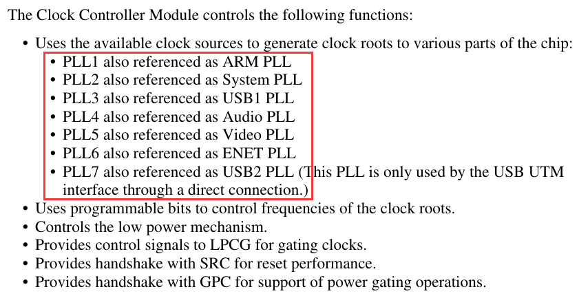
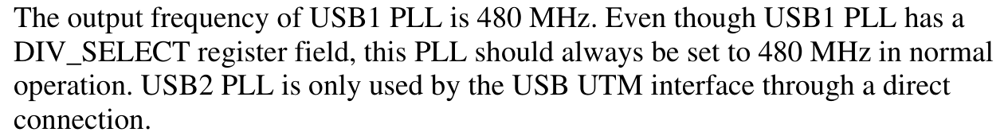
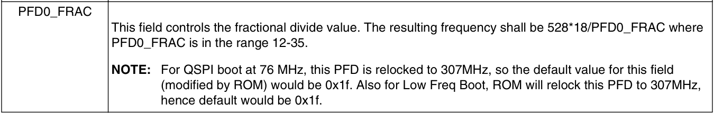
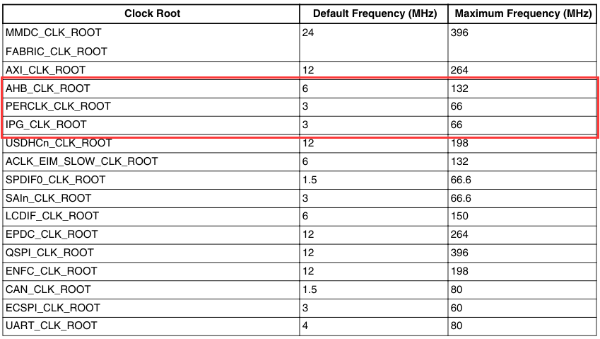
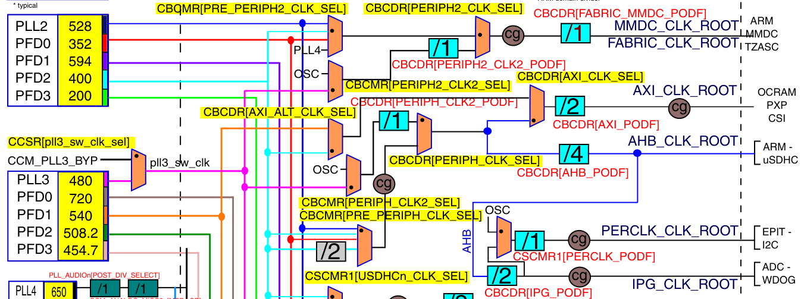

## 时钟

## 注意

第一次接触有关时钟的硬件层面，以及时钟树等概念，所以将在此处稍加篇幅来加深学习印象，也便于以后回顾

从图clock5中可以得出信息，PLL1的频率为650MHz到1.3GHz。

输出的频率如公式，其中Fref为晶振频率（24MHz），DIV_SEL由CCM_ANALOGPLL_ARM寄存器的DIV_SELECT位选择。

PLL1输出的频率即下图中pll1_sw_clk的值，由图可知，pll1_sw_clk有两路可以选择，pll1_main_clk和step_clk，通过CCSR寄存器的pll1_sw_clk_sel位来选择。

在修改系统时钟（PLL1）之前，需要给板子一个临时时钟，即step_clk。所以在修改PLL1时，需要将pll1_sw_clk切换为step_clk。

由图clock4可知，PLL1分频由CACRR寄存器的ARM_PODF位选择，其值如下图

## 时钟主频修改

> 1. 由上述材料可知，内核主频默认为498MHz，PLL1默认频率为其两倍（996MHz），此实验将把ARM内核主频修改为528MHz，由材料中的PLL1分频为1-8，而PLL1的频率范围为650MHz到1.3GHz，故欲设置内核主频为528MHz，只能将选择分频2，并且将PLL1的频率设置为1056MHz。
>
>    即 CACRR寄存器的ARM_PODF（2-0位）置为001（0x1），
>
>    DIV_SEL = 2 * PLLOutputFreq（1056MHz）/  Fref(24MHZ) = 88，即将CCM_ANALOGPLL_ARM寄存器的DIV_SELECT（6-0位）置为101 1000（0x58）
>
> 2.  在修改PLL1的配置时，其无法再作为主频时钟，因此在修改第一步当中的配置之前，需要更换时钟源，由上述资料中clock switcher章节的内容，将控制两个选择器来更换临时时钟源。
>
>    将CCSR寄存器的step_sel（8位）置为0，从晶振处获取频率
>
>    将CCSR寄存器的pll1_sw_clk_sel（2位）置为1，使得时钟频率来源为step_clk
>
>    完成上述操作之后再进行PLL1的相关寄存器修改，PLL1配置成功之后，再将上述pll1_sw_clk_sel置为0

## 修改PFD频率（以PLL2为例）

PLL2(system PLL)

PLL3(USB PLL)

上述两个PLL虽然都有DIV_SELECT字段，但是都只能在默认频率下工作，但是在时钟树图中可以看到，其下还有多个PFD可以进行配置。

欲将PFD0设置为352MHz，由公式可知PFD0_FRAC =  528MHz * 18 / 352MHz = 27 = 0x1B。594，400，200

其他的PFD也用同样的方式配置。

## 外设时钟源配置

修改AHB_CLK_ROOT、PERCLK_CLK_ROOT、IPG_CLK_ROOT，其中PERCLK_CLK_ROOT用于EPIT、I2C，IPG_CLK_ROOT用于ADC、WDOG

将上述三个时钟源都配置为最高频率

AHB_CLK_ROOT = 132MHz                             PERCLK_CLK_ROOT = IPG_CLK_ROOT = 66MHz

